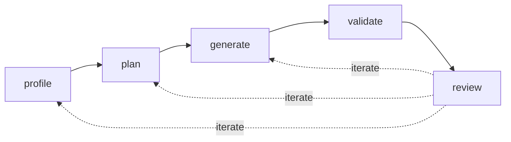

# nmt-migrate

An AI-powered migration agent that transforms telecom source data into IQGeo NMT-compatible format. It encodes "the IQGeo way" of doing a data migration — any delivery engineer can invoke it in VS Code to get a working first pass in hours rather than days.

Uses the NMT validation engine (`comms_db validate`) as the definition of done, and orchestrates Python CLI tools alongside `myw_db` / `comms_db` commands.

> Internal tool, internal team.

---

## Quick Start

### Prerequisites

- **VS Code** with GitHub Copilot (agent mode / Claude)
- **Python 3.10+** with dependencies: `pip install -r requirements.txt`
- **GDAL** (`ogrinfo` on PATH) for spatial format access
- **Docker** with an IQGeo NMT container (or native `myw_db` / `comms_db` on PATH)

### Create a new migration job

```bash
cp -r jobs/example jobs/<customer-slug>
```

Then:

1. Place source data in `jobs/<customer-slug>/source/`
2. Fill in `migration.yaml` — job metadata, source format/path/CRS, target database/container
3. Write `context.md` with everything known about the customer and source system
4. Open the orchestrator agent in VS Code and say: **"Run the entire migration loop"**

The agent reads `migration.yaml`, detects the target environment (Docker or native), and drives the pipeline end-to-end — pausing only when it hits ambiguity or needs a human decision.

### Run a single stage

You can also invoke individual stages:

- "Profile the source data" → runs just the `profile` stage
- "Plan the mappings" → runs just `plan`
- "Generate and load" → runs `generate`
- "Validate the migration" → runs `validate`
- "Produce the DMDD as Excel" → invokes the `docs` agent

---

## How It Works

A migration is a **loop**, not a one-shot pipeline. Five stages, each re-entered until the engineer is satisfied. The loop converges because state — `context.md`, the **DMDD**, and the **DQR** — accumulates knowledge across iterations.



### Stages

| # | Stage | What it does | Key outputs |
|---|---|---|---|
| 1 | **profile** | Crawl source data, infer schemas, sample rows, detect referential integrity, assess structural model type | `profile_report.md`, DMDD inventory, initial DQR |
| 2 | **plan** | Propose object/attribute mappings + structural transformation rules (containment, topology, connectivity) | DMDD mapping + relationship sections |
| 3 | **generate** | Produce a deterministic migration script (Python transform + shell loader), execute it, load into database | `transform.py`, `run_migration.sh`, CSV data files, load logs |
| 4 | **validate** | Run `comms_db <db> validate data '*'`, format severity-ranked report | Validation report |
| 5 | **review** | Reconcile counts, spot-check records, tag issues with re-entry points | `review_report.md` |

### When the agent pauses

The agent runs autonomously but stops to ask when it encounters:

- Ambiguous source data it can't resolve without domain knowledge
- High-impact decisions with no clearly-better option
- Blockers that failed a retry
- Confidence below 70% on a structural rule affecting >100 records
- Destructive actions (DROP, DELETE, overwriting previous outputs)

### Iteration

Each review issue is tagged with a re-entry point:

| Situation | Action | Re-enter at |
|---|---|---|
| New source knowledge | Update `context.md` | `profile` |
| Wrong mapping | Edit DMDD | `generate` |
| Broken source data | Update DQR, push back to customer | `profile` |
| Accepted limitation | Close DQR issue | — |

---

## Key Artefacts

### `migration.yaml`

Machine-readable job config. The orchestrator reads this at the start of every stage.

```yaml
job:
  name: "acme-fttx"
  customer: "ACME"
  status: "in_progress"

source:
  system: "ACME GIS"
  format: "geopackage"          # shapefile | geodatabase | csv | geopackage | postgis
  path: "./source/"
  crs: "EPSG:2236"

target:
  database: "acme_db"
  container: "iqgeo_acme"       # Docker container name (omit for native)
  crs: "EPSG:4326"

stages:
  profile: { status: "completed" }
  plan:    { status: "completed" }
  generate: { status: "in_progress" }
  # ...
```

### DMDD — Data Migration Design Document

The agent produces a populated DMDD the architect **reviews and corrects** rather than authors from scratch. Stored as `dmdd.yaml` (machine-readable) and optionally exported to `.xlsx` via `tools/docs_cli.py`.

| Section | Populated by | Purpose |
|---|---|---|
| `object_inventory` | `profile` | One row per source layer (geometry, count, include?) |
| `attribute_inventory` | `profile` | One row per source attribute (type, nulls, uniques) |
| `object_mapping` | `plan` | NMT feature type ← source layer + transformation |
| `attribute_mapping` | `plan` | NMT attribute ← source field + transform rules |
| `value_mapping` | `profile` + `plan` | Coded domain: source value → target value |
| `relationship_mapping` | `plan` | How NMT FK relationships are derived |
| `containment_rules` | `plan` | Parent→child inference and synthetic generation |
| `topology_construction` | `plan` | Cable segmentation, route derivation |
| `connectivity_mapping` | `plan` | Connection record construction |

### DQR — Data Quality Review

A decision register for data quality issues. If the DMDD says *what maps where*, the DQR says *how trustworthy the data is and where defects will be handled*.

Treatments: `fix_in_source` · `fix_in_flight` · `fix_in_target` · `accept_ignore` · `needs_decision`

Both DMDD and DQR are **living documents** — every stage keeps them in sync with reality.

### `context.md`

Human-supplied customer knowledge — what the data alone doesn't tell you:

- Terminology mapping ("their `pole` is our `aerial_structure`")
- Coded value meanings ("A = abandoned, not active")
- Known data quality issues
- Regional variations (CRS, units, language)
- Customer-specific business rules

---

## Repository Structure

```
nmt-migrate/
├── AGENTS.md                   # Orchestrator instructions (the "brain")
├── agents/                     # Stage subagents
│   ├── profile.agent.md
│   ├── plan.agent.md
│   ├── generate.agent.md
│   ├── validate.agent.md
│   ├── review.agent.md
│   ├── data-quality.agent.md
│   └── docs.agent.md          # On-demand document generation
├── tools/                      # Python CLI tools
│   ├── profile_cli.py         # Schema inference, sampling, DMDD inventory
│   ├── dmdd_cli.py            # DMDD YAML validation, summary, manipulation
│   ├── dqr_cli.py             # DQR issue lifecycle
│   ├── generate_cli.py        # Transform orchestration, load, reconcile
│   └── docs_cli.py            # Export DMDD/DQR/report to Excel/Word
├── templates/                  # YAML templates for new jobs
│   ├── dmdd_template.yaml
│   ├── dqr_template.yaml
│   └── profile_report_template.md
├── knowledge/                  # Reusable NMT + source-system knowledge
│   ├── nmt/                    # NMT schema, validation rules, containment model
│   └── source-systems/         # Known source format profiles
├── jobs/                       # Migration jobs (one folder per customer)
│   ├── example/                # Template job — copy this
│   └── obe/                    # Completed example (OBE FTTH Ixelles)
└── docs/                       # Design documents
```

### Job folder layout

```
jobs/<customer>/
├── migration.yaml              # Job config (orchestrator reads this first)
├── context.md                  # Human-supplied knowledge
├── dmdd.yaml                   # Data Migration Design Document
├── dqr.yaml                    # Data Quality Review
├── profile_report.md           # Profiling summary
├── source/                     # Source data files
└── output/                     # Generated artefacts
    ├── run_migration.sh        # Single-command entry point
    ├── scripts/transform.py    # Deterministic transform logic
    ├── data/                   # Generated CSVs for loading
    ├── defs/                   # .def files for myw_db
    └── logs/                   # Load and validation logs
```

---

## Architecture

**Agent-first:** the engineer describes intent ("profile the ACME data"); the agent determines which tools to call, handles ambiguity via LLM reasoning, and delegates computation to Python CLI tools.

- **Runtime**: VS Code + GitHub Copilot (agent mode, Claude model)
- **Agent definitions**: Markdown files with YAML frontmatter — runtime-agnostic
- **Compute**: Python CLI tools (`argparse`), matching `myw_db` / `comms_db` toolchain
- **Target access**: Docker exec or native CLI, auto-detected from `migration.yaml`

### Knowledge layers (highest priority first)

1. **Project-specific** — `context.md`, DMDD, DQR
2. **NMT-specific** — schema, validation, containment/connectivity/topology rules
3. **Source-system-specific** — known schemas, export quirks, geometry conventions

### Structural model transformation

A critical concern is transforming source data models into NMT's explicit containment/connectivity model. Source systems often use placement-based models (spatial proximity implies relationships), while NMT requires explicit containment (FKs, geometry inheritance, ordered segment chains).

The agent detects source model type during `profile` and encodes transformation rules in the DMDD during `plan`.

---

## Tools Reference

| Tool | Purpose |
|---|---|
| `profile_cli.py` | Schema inference, value profiling, null analysis, CRS detection, DMDD inventory |
| `dmdd_cli.py` | Validate, summarize, manipulate DMDD YAML |
| `dqr_cli.py` | Add/close/list DQR issues, severity summaries |
| `generate_cli.py` | Run transforms, load CSVs, reconcile counts, schema-check |
| `docs_cli.py` | Export DMDD → Excel, DQR → Word, profile → Word |

Run any tool with `--help` for usage:

```bash
python3 tools/profile_cli.py --help
python3 tools/docs_cli.py --help
```

---

## Out of Scope

- Web UI — this is a VS Code agent workflow
- Replacing the NMT validation engine (we wrap `comms_db validate`)
- Replacing `myw_db` (we orchestrate it)
- NMT product changes
