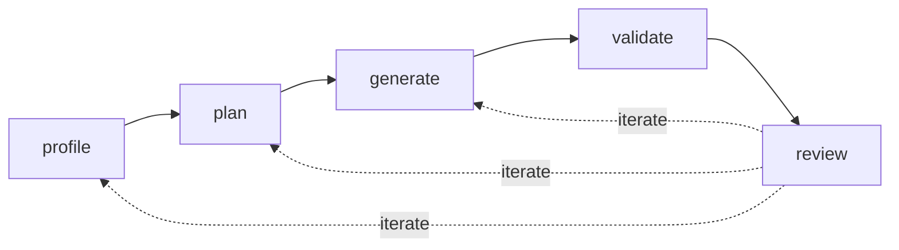

# nmt-migrate

A reusable migration **agent** that transforms source data into IQGeo NMT-compatible format. Defined through `AGENTS.md` and supporting instruction files, it encodes "the IQGeo way" of doing a migration — any delivery engineer can invoke it to get a usable first pass in hours rather than days.

Uses the NMT validation engine as the definition of done, and orchestrates purpose-built tools (a Python CLI, the validator, `myw_db`).

Internal tool, internal team, internal repo.

## How it works

A migration is a **loop**, not a one-shot pipeline. Five stages, each invokable independently, re-entered until the engineer is satisfied. The loop converges because state — `context.md`, the **DMDD**, and the **DQR** — accumulates knowledge across iterations.



### Stages

| # | Stage | What it does | Outputs |
|---|---|---|---|
| 1 | **profile** | Crawl source data, infer schemas, sample rows, check referential integrity, detect geometry conventions, flag gaps | DMDD inventory sheets, initial DQR, candidate value lists, profiling report |
| 2 | **plan** | Propose object/attribute mappings using NMT schema knowledge, naming heuristics, and DQR risk signals | DMDD mapping sheets (ObjectMapping, AttributeMapping, AttrVal-*) |
| 3 | **generate** | Produce `.def` files from templates, apply value mappings, apply `fix_in_flight` treatments, generate synthetic data, emit and execute load scripts | `.def` files, value mappings, `myw_db` load scripts, load logs, row count summary |
| 4 | **validate** | Run NMT validation engine, format severity-ranked report, link findings to DQR | Validation report, proposed fixes |
| 5 | **review** | Engineer audits correctness: spatial sanity, statistical reconciliation, spot checks, connectivity tracing | `review.md` with issues and re-entry points |

### Human gates

The pipeline pauses for human review:
- After `profile` (before plan)
- After `plan` (before generate)
- Before any `fix_in_flight` transformations
- Before database writes

Generate→validate runs autonomously. Validate→review is human-driven.

### Iteration

Each review issue is tagged with where to re-enter:

- **New source knowledge** → update `context.md`, re-run from `profile`
- **Wrong mapping** → edit DMDD, re-run from `generate`
- **Broken source data** → update DQR, push back to customer, re-run from `profile`
- **Accepted limitation** → close DQR issue as `accept_ignore`

## Key artefacts

### DMDD — Data Migration Design Document

The agent's first goal is to produce a populated DMDD the architect **reviews and corrects** rather than authors from scratch.

Stored as `dmdd.xlsx` (human interface) and `dmdd.yaml` (machine interface), kept in bidirectional sync.

| Sheet | Populated by | Purpose |
|---|---|---|
| **Summary** | architect | Metadata, instructions, status definitions |
| **ObjectInventory** | `profile` | One row per source object class (Feature, Count, Include?) |
| **AttributeInventory** | `profile` | One row per source attribute (type, nulls, uniques, Include?) |
| **ObjectMapping** | `plan` → architect | Target-first: IQGeo feature ← source mapping + transformations |
| **AttributeMapping** | `plan` → architect | Target-first: IQGeo attribute ← source field + transformation rules |
| **AttrVal-\*** | `profile`/`plan` → architect | One sheet per coded domain: source value + count → target value |

### DQR — Data Quality Review

A decision register for data quality issues affecting migration effort, risk, and sign-off. If the DMDD says *what maps where*, the DQR says *how trustworthy the data is and where defects will be handled*.

Key fields: `id`, `category`, `source_object`/`source_attribute`, `check`, `affected_count`/`affected_percent`, `examples`, `severity`, `treatment`, `target_area`, `dmdd_refs`, `status`, `owner`.

Treatments: `fix_in_source` | `fix_in_flight` | `fix_in_target` | `accept_ignore` | `needs_decision`

### `migration.yaml`

Machine-readable job config. Key fields: `source_location`, `source_crs`, `source_system`, `nmt_version`, `target_db`, `prefix`, `dummy_structure_policy`, `context_files`, `knowledge_packs`.

### `context.md`

Human-supplied customer knowledge — what the data alone doesn't tell you:

- Terminology mapping ("their `pole` is our `aerial_structure`")
- Coded value meanings ("A = abandoned, not active")
- Known data quality background
- Regional variations (CRS, units)
- Customer-specific business rules
- Open questions

## Repository structure

```
nmt-migrate/
├── AGENTS.md                  Orchestrator: persona, stage sequencing, gating
├── agents/                    Stage subagents
│   ├── profile.agent.md
│   ├── plan.agent.md
│   ├── generate.agent.md
│   ├── validate.agent.md
│   ├── review.agent.md
│   └── data-quality.agent.md
├── tools/                     Python CLI tools (Typer/Click)
│   ├── profile_cli.py        schema inference, sampling, DMDD inventory
│   ├── dmdd_cli.py           xlsx ↔ yaml sync, diff, merge
│   ├── dqr_cli.py            issue lifecycle, treatment summaries
│   ├── generate_cli.py       .def generation, synthetic data, load scripts
│   ├── validate_cli.py       NMT validation wrapper
│   └── reconcile_cli.py      source-vs-target counts
├── templates/                 .def templates (structure, route, conduit, cable, equipment, connection)
├── knowledge/                 Reusable across migrations
│   ├── nmt/                   Schema, validation, conventions (versioned)
│   ├── source-systems/        Source format profiles and precedents
│   └── dmdd-templates/        Reference spreadsheets
├── examples/                  Past migrations as fixtures
└── docs/
```

## Customer job layout

Each migration lives in its own folder/repo:

```
acme-migration-2026/
├── migration.yaml
├── context.md
├── dmdd.xlsx / dmdd.yaml
├── dqr.xlsx / dqr.yaml
├── source/
└── output/
```

## Architecture

**Agent-first:** the engineer describes intent ("profile the ACME data"); the agent determines which tools to call. LLM reasoning handles ambiguity and loop decisions; Python handles computation.

- VS Code + Copilot/Claude as agent runtime
- Agent files are runtime-agnostic markdown
- Python CLI matches `myw_db` toolchain

### Knowledge layers (later overrides earlier)

1. **Project-specific** — `context.md`, DMDD, DQR. Customer terminology, decisions, limitations.
2. **NMT-specific** — schema, validation patterns, templates. Versioned by NMT release.
3. **Source-system-specific** — known schemas, aliases, geometry conventions, export quirks.

### Subagents

The orchestrator uses the **coordinator and worker pattern**:

- `.agent.md` files, `user-invocable: false`, listed in orchestrator's `agents` frontmatter
- Read-only tool access; orchestrator handles all writes
- Return structured summaries; no nesting

## Out of scope

- Web UI
- Customer-facing version
- Replacing the validation engine (we wrap it)
- Replacing `myw_db` (we orchestrate it)
- NMT product changes
