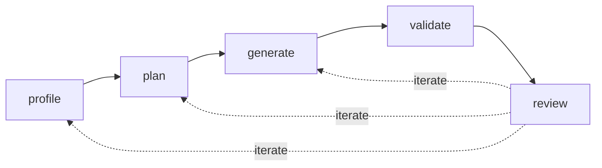

# nmt-migrate — Workshop Starting Point

**Status:** Draft / pre-workshop starting point for discussion, not a spec.

## Objective

Build a reusable migration **agent** — defined through `AGENTS.md` and supporting instruction files — that any delivery engineer can invoke to get a usable first pass in hours rather than days. It encodes "the IQGeo way" of doing a migration, uses the NMT validation engine as the definition of done, and orchestrates purpose-built tools (a Python CLI, the validator, `myw_db`).

Internal tool, internal team, internal repo.

By Thursday evening: one past migration driven through the agent far enough to compare against the manual version. Fallback success: a strong profile-to-DMDD/DQR workflow.

## What it does

A migration is a **loop**, not a one-shot pipeline. Five stages, each invokable independently, re-entered until the engineer is satisfied. The loop converges because state — `context.md`, the **DMDD**, and the **DQR** — accumulates knowledge across iterations.

### The Data Migration Design Document (DMDD)

Architects already produce a DMDD spreadsheet capturing source inventory, feature/attribute mappings, and in-flight transformations. By the time it's correct, generation is mechanical. Today it takes days of manual work.

**The agent's first goal is to produce a populated DMDD the architect reviews and corrects rather than authors from scratch.** Profile populates the source inventory; plan proposes mappings. The architect's job shifts from *authoring* to *reviewing*.

Stored as `dmdd.xlsx` (human interface) and `dmdd.yaml` (machine interface), kept in bidirectional sync by the agent.

### The Data Quality Review (DQR)

The DQR is a decision register for data quality issues affecting migration effort, risk, and sign-off. If the DMDD says *what maps where*, the DQR says *how trustworthy the data is and where defects will be handled*.

It captures: issue description, evidence (counts, examples), impact, treatment decision, and workflow state.

V1 defines a small internal YAML contract (`dqr.yaml`) with these key fields:

| Field | Purpose |
|---|---|
| `id` | Stable identifier, referenced from DMDD and reports |
| `category` | Completeness, validity, consistency, referential integrity, spatial, domain, duplication, etc. |
| `source_object` / `source_attribute` | Where found |
| `check` | Detection rule or observation |
| `affected_count` / `affected_percent` | Scope |
| `examples` | Sample values/IDs for review |
| `severity` | blocker, high, medium, low, info (migration impact) |
| `treatment` | `fix_in_source`, `fix_in_flight`, `fix_in_target`, `accept_ignore`, `needs_decision` |
| `target_area` | NMT feature/attribute affected |
| `dmdd_refs` | Linked DMDD rows |
| `status` | New → Under Review → Agreed → Implemented → Verified → Accepted/Closed |
| `owner` / `ticket` / `notes` | Workflow context |

**DMDD is the design surface; DQR is the risk surface.** They inform each other at every stage.

### The five stages



**1. profile** — Crawl source data, infer schemas, sample rows, check referential integrity, detect geometry conventions, flag gaps. Detects ambiguities and writes questions into `context.md`. **Outputs:** DMDD ObjectInventory + AttributeInventory sheets, initial DQR, candidate AttrVal-\* value lists, profiling report. *This is where the most engineering time goes and is the workshop priority.*

**2. plan** — Populate ObjectMapping, AttributeMapping, and AttrVal-\* sheets of the DMDD using NMT schema knowledge, naming heuristics, and DQR risk signals. Links in-flight quality fixes to DQR issues. Architect reviews and signs off. The completed DMDD *is* the plan.

**3. generate** — Produce `.def` files from templates, apply value mappings, apply agreed `fix_in_flight` DQR treatments, generate synthetic data (dummy structures, routes, fiber segments), emit `myw_db` load scripts.

**4. validate** — Run NMT validation engine, format severity-ranked report, optionally propose auto-fixes. Links findings to DQR. Validates **internal consistency only**, not correctness.

**5. review** — Engineer audits for *correctness*: spatial sanity, statistical reconciliation (source vs. migrated counts), sample spot checks, connectivity tracing. Outputs `review.md` with issues, re-entry points, and DQR updates.

### Iteration

Each review issue is tagged with where to re-enter:

- **New source knowledge** → update `context.md`, re-run from `profile`
- **Wrong mapping** → edit DMDD, re-run from `generate`
- **Broken source data** → update DQR, push back to customer, re-run from `profile`
- **Accepted limitation** → close DQR issue as `accept_ignore`

The pipeline pauses for human review between profile→plan and plan→generate. Generate→validate runs autonomously. Validate→review is human-driven.

## Inputs & key artefacts

All live in the customer's migration job folder, version-controlled.

### 1. `migration.yaml` — machine-readable config

Indicative fields: `source_location`, `source_crs` (required), `source_system`, `nmt_version`, `target_db`, `prefix` (default `ai_`), `dummy_structure_policy`, `equipment_proximity_radius_m`, `context_files`, `knowledge_packs`, per-category overrides.

### 2. `context.md` — human-supplied customer knowledge

What the data alone doesn't tell you. Indicative content:

- Terminology mapping ("their `pole` is our `aerial_structure`")
- Coded value meanings ("A = abandoned, not active")
- Value mapping tables
- Known data quality background
- Regional variations (CRS, units)
- Skips and ignores
- Customer-specific business rules
- Open questions

The engineer fills in what they know; profile proposes additions where it spots ambiguity. Can be split into per-region files referenced from `migration.yaml`.

By end of migration, `context.md` + DMDD + DQR become the handoff record.

### 3. `dmdd.xlsx` / `dmdd.yaml`

**Structure (from `DMDD_HH_v1.1.xlsx` — six sheets):**

| Sheet | Populated by | Purpose |
|---|---|---|
| **Summary** | architect | Metadata, instructions, status definitions |
| **ObjectInventory** | `profile` | One row per source object class (Feature, Count, Include?) |
| **AttributeInventory** | `profile` | One row per source attribute (type, nulls, uniques, Include?) |
| **ObjectMapping** | `plan` → architect | Target-first: IQGeo feature ← source mapping + transformations |
| **AttributeMapping** | `plan` → architect | Target-first: IQGeo attribute ← source field + transformation rules |
| **AttrVal-\*** | `profile`/`plan` → architect | One sheet per coded domain: source value + count → target value |

Key design points:
- Mapping sheets are **target-first** (rows are IQGeo features/attributes)
- Inventory sheets are **source-first** (rows are source objects/attributes)
- Tracking columns (Status, Review Comments, Jira) for human workflow
- Status values: `Pending Review`, `Pending Comment Resolution`, `Remove`, `Approved - Attribute`, `Approved - Mapping`
- Spreadsheet = human interface; YAML = machine interface; agent keeps them in sync

### 4. `dqr.xlsx` / `dqr.yaml`

For v1, the YAML schema and issue lifecycle matter more than spreadsheet styling. DQR issue counts by severity/treatment feed migration sizing and risk assessment.

## Proposed architecture

The agent orchestrates; CLI tools do the compute.

```
nmt-migrate/
├── AGENTS.md                  Orchestrator: persona, stage sequencing, gating
├── agents/                    Stage + worker subagents
│   ├── profile.agent.md
│   ├── plan.agent.md
│   ├── generate.agent.md
│   ├── validate.agent.md
│   ├── review.agent.md
│   └── data-quality.agent.md
├── tools/                     Python CLI tools (Typer/Click)
│   ├── profile_cli.py        schema inference, sampling, DMDD inventory
│   ├── dmdd_cli.py           xlsx ↔ yaml sync, diff, merge
│   ├── dqr_cli.py            issue lifecycle, treatment summaries
│   ├── generate_cli.py       .def generation, synthetic data, load scripts
│   ├── validate_cli.py       NMT validation wrapper
│   └── reconcile_cli.py      source-vs-target counts
├── templates/                 .def templates (structure, route, conduit, cable, equipment, connection)
├── knowledge/                 Reusable across migrations
│   ├── nmt/                   Schema, validation, conventions (versioned)
│   ├── source-systems/        Source format profiles and precedents
│   └── dmdd-templates/        Reference spreadsheets
├── examples/                  Past migrations as fixtures
└── docs/
```

Customer migration job (separate repo):

```
acme-migration-2026/
├── migration.yaml
├── context.md
├── dmdd.xlsx / dmdd.yaml
├── dqr.xlsx / dqr.yaml
├── source/
└── output/
```

Python for CLI (matches `myw_db` toolchain). VS Code + Copilot/Claude as agent runtime. Agent files are runtime-agnostic markdown.

Knowledge layers at runtime (later overrides earlier): NMT defaults → source-system profiles → project-specific context.

### Why agent-first

The engineer describes intent ("profile the ACME data"); the agent determines which tools to call. LLM reasoning handles ambiguity and loop decisions; Python handles computation. The engineer interacts conversationally rather than memorising CLI flags.

### Subagents

The orchestrator uses the **coordinator and worker pattern** with VS Code subagents for:

1. **Context isolation** — each subagent gets only its relevant slice of context
2. **Parallel execution** — independent subtasks run concurrently

Rules for v1:
- `.agent.md` files, `user-invocable: false`, listed in orchestrator's `agents` frontmatter
- Read-only tool access; orchestrator handles all writes
- Return structured summaries; no nesting
- Lighter models for mechanical tasks, full model for reasoning

Stages define *when*; subagents define *how work is decomposed within* a stage. Specific subagents TBD during workshop.

## Accumulated reusable knowledge

Three layers, in precedence order (highest first):

1. **Project-specific** — `context.md`, DMDD, DQR, reports. Customer terminology, decisions, limitations.
2. **NMT-specific** — schema, validation patterns, templates, standard transforms. Versioned by NMT release.
3. **Source-system-specific** — known schemas, aliases, geometry conventions, export quirks. Reusable profiles.

Promotion path: lessons start in project context, get generalised and reviewed before entering shared knowledge. For v1: markdown/YAML in git.

## Workshop frame

Tuesday through Thursday evening. Answer opening questions, build against one benchmark migration, close with honest readout.

The `plan` stage stays human-reviewed for v1 — the agent proposes, the architect confirms. One credible loop is the target; profile alone producing solid DMDD inventory + DQR is the fallback.

## Opening questions

1. **Benchmark migration** — Which past migration? Small enough to iterate, representative enough to be useful?
2. **Source format scope** — Benchmark-only, CSV-first, or thin ingestion layer for multiple formats?
3. **Agent runtime** — VS Code + Copilot/Claude confirmed, or other editors needed?
4. **Universal vs. configurable rules** — Which conventions are NMT requirements vs. engineer style?
5. **NMT version target** — Pin one version for v1?
6. **DMDD contract** — Exact template, YAML schema, transformation representation?
7. **DQR contract** — Taxonomy, severity, treatments, lifecycle, review format?
8. **Reusable knowledge boundary** — What goes where?
9. **Human gates** — Minimum: after profile, after plan, before `fix_in_flight`, before DB writes.
10. **Auto-fix policy** — Propose-only for v1?
11. **Job layout** — Per-customer repo or central `migrations/` area?

## Out of scope

- Web UI
- Customer-facing version
- Replacing the validation engine (we wrap it)
- Replacing `myw_db` (we orchestrate it)
- NMT product changes

## Thursday evening success

1. Benchmark migration driven through the agent (ideally with one review-driven iteration)
2. DMDD + DQR from source data that an architect recognises as a credible 70–80% first pass
3. Plan/generate/validate path demonstrable (even if rough)
4. Output reviewable by an engineer who didn't build the tool
5. Artefacts form a credible handoff record
6. Team agrees on v0.2 backlog

Fallback: profile alone producing solid DMDD source inventory + initial DQR.
